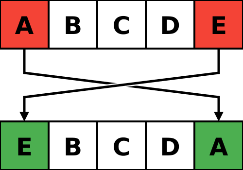
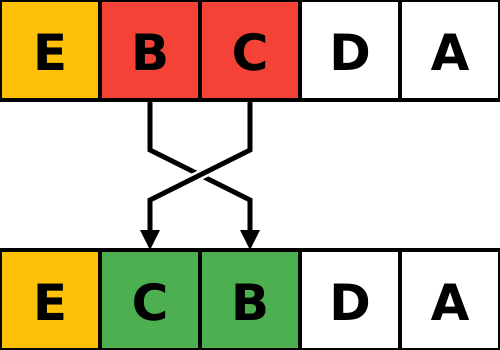
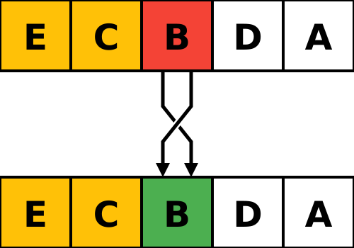
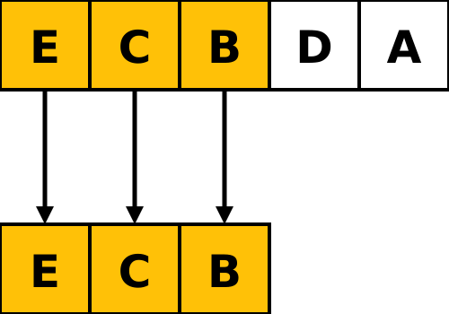

# Lottery

_An auditable, Blockchain-based, Lottery._

---

- [General Concepts](#general-concepts)
  - [Quick Start](#quick-start)
    - [Getting the Lottery out of the Way](#getting-the-lottery-out-of-the-way)
    - [Creating a New Lottery](#creating-a-new-lottery)
    - [Querying Lottery Winners](#querying-lottery-winners)
- [A Lottery's Configuration](#a-lotterys-configuration)
- [Non-persisted Interface](#non-persisted-interface)
- [Persisted Interface](#persisted-interface)
- [Algorithmic Details](#algorithmic-details)
  - [The Random Bits Generator](#the-random-bits-generator)
  - [The "Fast Dice Roller](#the-fast-dice-roller)
  - [The Fisher-Yates Selector](#the-fisher-yates-selector)
- [Tips & Tricks](#tips--tricks)
  - [Progressive Results](#progressive-results)
  - [Non-Uniform Probabilities](#non-uniform-probabilities)
  - [Generate & _then_ Commit](#generate--then-commit)

---

## General Concepts

The purpose of this contract is to implement a Lottery that will raffle out a certain amount of prizes amongst a certain number of players.
It will do this in an auditable manner, and it provides the option of persisting the results in the Blockchain, so as to serve as a proof of prize allocation.

A Lottery in this sense, consists of a list of players (eg. a list of names, or addresses, or aliases, etc.), a number of winners to be allotted prizes, and a seed to use in order to prime the [Random Bits Generator](#the-random-bits-generator).

Such a Lottery can be created (provided a name is assigned to it), and the winners (implicitly) persisted forever on the Blockchain.

Additionally, a Lottery can be run "blindly" without persisting to the Blockchain, and serve as a quick way to allot prizes when auditing is not an issue.

In what follows, we'll delve deeper into the particulars of the Lottery's implementation, but before that, we'll present a [Quick Start](#quick-start) guide for the impatient.

### Quick Start

Let's say we want to raffle out **5** _Golden Tickets_ to a tour of _Willy Wonka's Chocolate Factory_.
The list of children interested in these is[^cast]: Alice, Bob, Carol, Chad, Charlie, Craig, Dan, David, Erin, Eve, Faythe, Frank, Grace, Heidi, Ivan, Judy, Mallory, Michael, Olivia, Oscar, Peggy, Rupert, Sybil, Trent, Trudy, Vanna, Victor, Walter, Wendy, and Yves, 30 in total (note that this list is sorted, but it need not be so).

[^cast]: Taken _ad lib_ from [Wikipedia > Alice and Bob](https://en.wikipedia.org/wiki/Alice_and_Bob#Cast_of_characters).

Finally, let's use `"0x0000000000000000000000000000000000000000000000000000000000000000"` as the random seed.

With the preliminaries out of the way, head on over to [PolygonScan > Contract](https://polygonscan.com/address/0x1842d9456dfD1f785F69Df789150481af941b2b9).

#### Getting the Lottery out of the Way

To get the Lottery out of the way, you can simply call the [`simulate(bytes32,uint256,string[])`](https://polygonscan.com/address/0x1842d9456dfD1f785F69Df789150481af941b2b9#readContract#F5) method, providing the following parameters:

`seed (bytes32)`
: `"0x0000000000000000000000000000000000000000000000000000000000000000"`

`numberOfWinners (uint256)`
: `5`

`players (string[])`
: `["Alice", "Bob", "Carol", "Chad", "Charlie", "Craig", "Dan", "David", "Erin", "Eve", "Faythe", "Frank", "Grace", "Heidi", "Ivan", "Judy", "Mallory", "Michael", "Olivia", "Oscar", "Peggy", "Rupert", "Sybil", "Trent", "Trudy", "Vanna", "Victor", "Walter", "Wendy", "Yves"]`

This will return:

`string[]`
: `Sybil,Alice,Erin,Charlie,Grace`

signifying that Alice, Charlie, Erin, Grace, and Sybil are the winners.

#### Creating a New Lottery

Alternatively, we can create a new Lottery and have it be persisted on the Blockchain forever by calling the [`create(string,bytes32,uint256,string[])`](https://polygonscan.com/address/0x1842d9456dfD1f785F69Df789150481af941b2b9#writeContract#F2) method with:

`name (string)`
: `"Willy Wonka's Chocolate Factory Tour"`

`seed (bytes32)`
: `"0x0000000000000000000000000000000000000000000000000000000000000000"`

`numberOfWinners (uint256)`
: `5`

`players (string[])`
: `["Alice", "Bob", "Carol", "Chad", "Charlie", "Craig", "Dan", "David", "Erin", "Eve", "Faythe", "Frank", "Grace", "Heidi", "Ivan", "Judy", "Mallory", "Michael", "Olivia", "Oscar", "Peggy", "Rupert", "Sybil", "Trent", "Trudy", "Vanna", "Victor", "Walter", "Wendy", "Yves"]`

If everything is OK, you'll get:

`bool`
: `true`

Signifying that the Lottery was created successfully.

#### Querying Lottery Winners

Finally, we can check who won the the _"Willy Wonka's Chocolate Factory Tour"_ Lottery by calling [`winners(string)`](https://polygonscan.com/address/0x1842d9456dfD1f785F69Df789150481af941b2b9#readContract#F6) with parameters:

`name (string)`
: `"Willy Wonka's Chocolate Factory Tour"`

Yielding:

`string[]`
: `Sybil,Alice,Erin,Charlie,Grace`

Note how this coincides with our initial simulation above.

## A Lottery's Configuration

A Lottery configuration (viz. `Config`) consists of 3 parts:

- a **seed**: this is a block of bytes used to prime the random number generator,
- a **number of winners**: this is the number of prizes that will be raffled out, and
- a **players** list: a list of strings, one for each player (but see [below](#tips--tricks) for alternatives).

A configuration can be generated from its parts by calling the [`build(bytes32,uint256,string[])`](https://polygonscan.com/address/0x1842d9456dfD1f785F69Df789150481af941b2b9#readContract#F1) method, but this is indeed quite unnecessary, since one can simply build one such configuration like so:

    [
        "0x0000000000000000000000000000000000000000000000000000000000000000",
        5,
        [
            "Alice", "Bob", "Carol", "Chad", "Charlie",
            "Craig", "Dan", "David", "Erin", "Eve",
            "Faythe", "Frank", "Grace", "Heidi", "Ivan",
            "Judy", "Mallory", "Michael", "Olivia", "Oscar",
            "Peggy", "Rupert", "Sybil", "Trent", "Trudy",
            "Vanna", "Victor", "Walter", "Wendy", "Yves"
        ]
    ]

Even more so, all the interfaces accepting a `Config` parameter accept the part-wise parameters as well.

## Non-Persisted Interface

This is the easiest interface to use, and it consists solely of `pure` methods, thus incurring no transaction cost at all.
The methods exposed are:

[`simulate(tuple)`](https://polygonscan.com/address/0x1842d9456dfD1f785F69Df789150481af941b2b9#readContract#F4)
: Takes a `Config` and returns the Lottery winners.

[`simulate(bytes32,uint256,string[])`](https://polygonscan.com/address/0x1842d9456dfD1f785F69Df789150481af941b2b9#readContract#F5)
: Takes a part-wise description of a Lottery's configuration and returns the Lottery winners.

The downside to using these methods is that nothing gets persisted to the Blockchain, making auditing impossible.

## Persisted Interface

This interface is a bit more involved than the [non-persisted one](#non-persisted-interface), but allows for the Lottery configuration to be persisted on the Blockchain, making it easily auditable.
All Lotteries, once persisted to the Blockchain, are identified by a _name_, and this is the only handle needed to retrieve or interact with them.

The read-only methods exposed are:

`exists(string)`
: Determine whether the given Lottery name already exists.

`get(string)`
: Retrieve the `Config` associated to the given Lottery name.

`winners(string)`
: Retrieve the list of winners associated to the given Lottery name.

The write methods exposed are:

`create(string,tuple)`
: Create a Lottery with the given name, using the given `Config`, returns `true` on success.

`create(string,bytes32,uint256,string[])`
: Create a Lottery with the given name, using the given parts-wise description of a Lottery's configuration, returns `true` on success.

Note that, upon creation, the winners of a Lottery are implicitly determined, as they depend solely on the list of players and seed provided.

## Algorithmic Details

If you made it here, you're definitely motivated to learn how this tiny contract works!
Kudos to you.
Pat yourself on the back.

In what follows we'll explore the three more algorithmic aspects behind the Lottery contract itself.

### The Random Bits Generator

In order to generate the list of winners, we'll need a source of "randomness".
Barring a (mostly philosophical) discussion around what we mean by "randomness", what this means in practice is _an infinite and reproducible source of bits_:

- we need this bit source to be infinite because we don't _a priori_ know how many we'll actually use, and there's no limit (imposed by this contract at least) to the number of players, and
- we need the bit source to be reproducible because we want to generate the same bit-stream when priming the generator with the same seed.

The bits generator we use works as follows:

1. set the `state` to the given `seed`,
2. set the `current` bit index to `0`,
3. set the `round` counter to `0`,
4. repeat forever:
    1. if the `current` bit index is `0`, then:
        1. set the `state` to the result of `keccak256(state || round)`[^concatenation],
        2. set the `round` counter to `round + 1`.
    2. **`emit`** the bit at position `current` in the `state`,
    3. set the `current` bit index to `(current + 1) % 256`[^modulus].

[^concatenation]: The `||` symbol means "byte-wise concatenation", ie. the result of tacking the involved bytes one after the other, in the order given.
[^modulus]: This modulus (ie. `%`) operation can be implicitly performed "for free" by storing the `current` bit index in an 8-bit variable and allowing it to wrap around on overflow (ie. using `unchecked` in Solidity).

In the previous discussion, the **`emit`** instruction is intended to signify the actual generation of random bits.
In practice, this is accomplished by having the `state`, `current`, and `round` variables all packed together in a single structure (viz. the `_Rng` implementation-only structure), and having a specific implementation method (viz. `_getBit`) manipulate it and return the intended bit.

> **A note about security**
>
> The procedure thus presented is not particularly "secure" in a cryptographic sense, the good news is that we don't need it to be: take into account that all of this happens "above table" so to speak, in a "white box" setting.

The last "quirk" left to be explained is the concatenation with the `round` counter.
This is done in order to prevent the (admittedly, apparently improbable case of the) iterated hashing from cycling into a _fixed point_, ie. a value of `state` such that `keccak256(state)` equals `state` itself.
By making the argument to `keccak256` non-repeating, we prevent this situation from ever arising.

### The "Fast Dice Roller"

Now that we have a big enough (actually, infinite) source of bits, we need a way of turning them into actual concrete numbers in a specific range.
Doing so in a _uniform_ manner (ie. where _all_ the numbers in the range having the _same_ probability of being chosen) is not as straightforwards as one may think.[^modulo-bias]

[^modulo-bias]: See [Wikipedia > Fisher--Yates shuffle > Modulo bias](https://en.wikipedia.org/wiki/Fisher%E2%80%93Yates_shuffle#Modulo_bias) for a cursory explanation of the problem, in the specific case of Fisher--Yates shuffling (coincidentally, this is the algorithm we'll visit further down).

Luckily, a fast, scalable, and simple solution to this exists: the "Fast Dice Roller" algorithm of J&eacute;r&eacute;mie Lumbroso.

Although the detailed discussion of this algorithm is beyond the scope of this README, the interested reader can consult the original paper here: [Optimal Discrete Uniform Generation from Coin Flips, and Applications --- J&eacute;r&eacute;mie Lumbroso (2013)](https://arxiv.org/pdf/1304.1916).

### The Fisher-Yates Selector

Finally, with a robust way of generating bits, and turning them into numbers in a desired range, we can now turn our attention to actually selecting winners from the list of players.

Assume we have a list `players` of players (of length `l`), and we want to select `n` out of them as winners (with `n` at most equalling `l`).
The way we're going to go about it is conceptually simple:

1. for `i` between `0` and `n` exclusive, repeat:
    1. generate a random number between `0` and `l - i`, call it `j`,
    2. exchange the players in the `i`-th and `i + j`-th positions.
2. keep only the first `n` players in the list, call these the winners.

By way of example, let's say we have 5 players: Alice, Bob, Chary, David, and Eve, and we'd like to select 3 of them as winners.
Here's what's happening:

- at the very first iteration, `i` equals 0, `j` will take a uniformly random number in the `[0, 5)` interval, say 4, then `i + j` will equal `0 + 4 = 4`, thus, we swap the 0-th and 4-th positions in the `players` list:

- at the very first iteration, `i` equals 1, `j` will take a uniformly random number in the `[0, 4)` interval, say 1, then `i + j` will equal `1 + 1 = 2`, thus, we swap the 1-th and 2-th positions in the `players` list:

- at the very third and last iteration, `i` equals 2, `j` will take a uniformly random number in the `[0, 3)` interval, say 0, then `i + j` will equal `2 + 0 = 2`, thus, we swap the 2-th and 2-th positions in the `players` list (ie. we do nothing):

- finally, only the first 3 positions matter, so we simply drop the rest:

This is noting more than the [Fisher--Yates Shuffle](https://en.wikipedia.org/wiki/Fisher%E2%80%93Yates_shuffle) being executed until the `n`-th step and bailing out afterwards.

That this procedure generates winners with a _uniform_ distribution follows from the fact that the [Fisher--Yates Shuffle](https://en.wikipedia.org/wiki/Fisher%E2%80%93Yates_shuffle) generates permutations uniformly, and that it proceeds incrementally whilst doing so, thus, terminating the algorithm's run early, leaves us with a uniform selection at every step.

## Tips & Tricks

In what follows, we'll show some tips and tricks in order to use the Lottery contract in ways other than the originally intended one.

### Progressive Results

Using the `simulate()` methods, one can generate winners "incrementally", ie. the first 3 winners are generated, the the next 3, and so on and so forth.
This is very easy to accomplish and just entails calling `simulate()` with progressively higher values of the `numberOfWinners` configuration part.

The reason why this works, is that the winners list is generated "from left to right", and thus when generating, say, either 3 or 6 winners, the first 3 will always coincide (provided the `seed` stays the same).

### Non-Uniform Probabilities

Sometimes the Lottery probabilities should not be allotted uniformly, but rather according to some other proportionality criterion.
In order to achieve this with the Lottery contract, you can simply insert duplicate entries in the `players` configuration part, according to the _odds_ allotted to each participant.

For instance, let's say we have three players, **A**, **B**, and **C**, furthermore, let's say that **A** is given 1 odd, **B** is given 2, and **C** is given three, then presenting a `players` list like the following:

    ["A", "B", "B", "C", "C", "C"]

will realize the required probabilities.

A complication that arises in this case, is that repeated winners can appear.
When this happens, one can simply ignore duplicates, as the winners themselves will be allotted proportionally to the `players` list.
The downside of this is that you may thus get _less_ winners after duplicates removal, but this can be very easily overcome by applying the same strategy as mentioned [above](#progressive-results): simply continue to generate more and more winners until the given number of _unique_ winners is met.

Do note though, that in order to commit this to the Blockchain, a strategy like the one [below](#generate--then-commit) must be employed to ensure transparency.

### Generate & _then_ Commit

Although most of the times all the parameters in a Lottery's `Config` will be known beforehand, sometimes this is not the case (see the problem [above](#non-uniform-probabilities)).
A way around this is: _simulate until the conditions needed are satisfied, then commit the resulting `Config` by calling `create()`_.

This method has all the advantages and none of the downsides, since you're free to experiment with the `Config` to your heart's content, and eventually commit it to the Blockchain and have every interested player audit it.

Needless to say, on the spirit of fairness and transparency, the `seed` parameter should be chosen in such a way so as to disperse any doubts as to the creator's advantage (eg. agreeing upon the seed beforehand, by a trusted third party, by partial mutual generation, etc.).
The `players` list order should also be taken into account and fairly and unambiguously determined (the `seed` and the `players` list order being the only two parameters having any impact on the Lottery's result).
